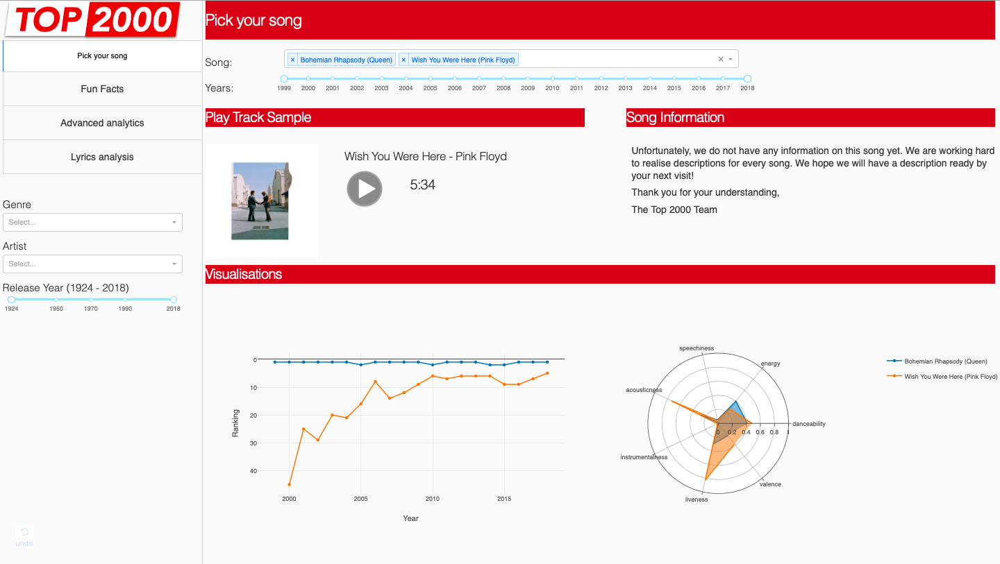
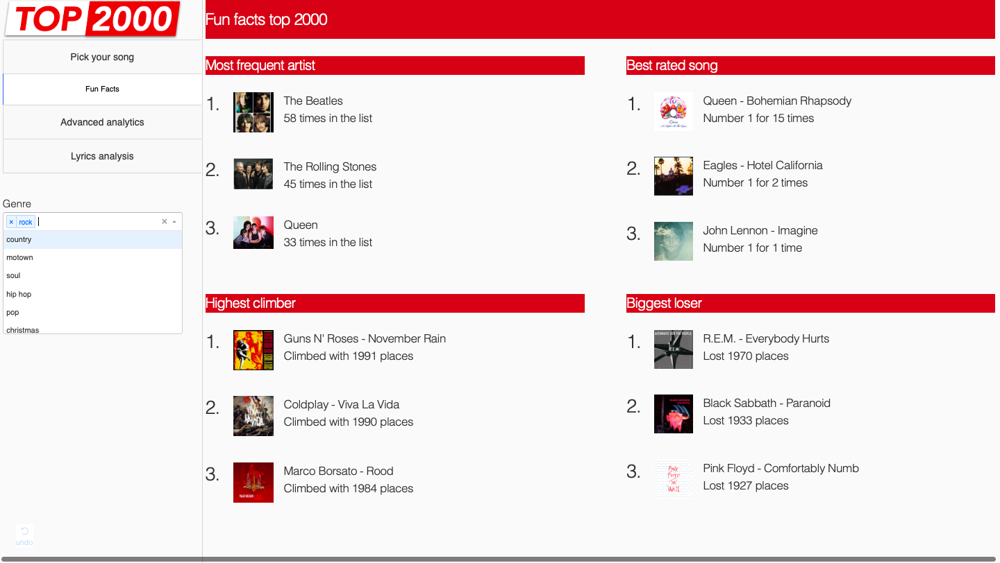
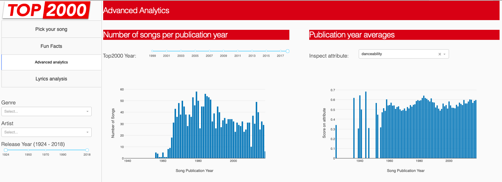
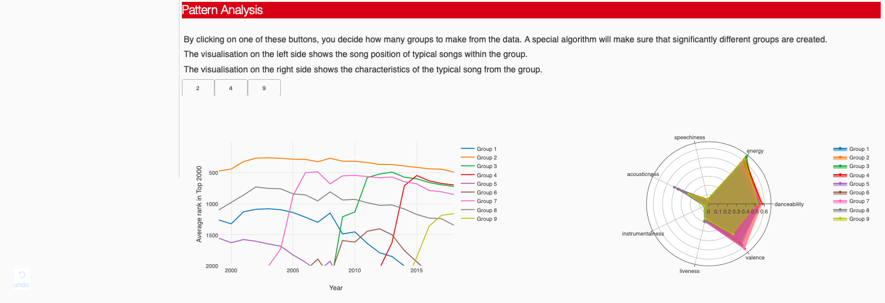
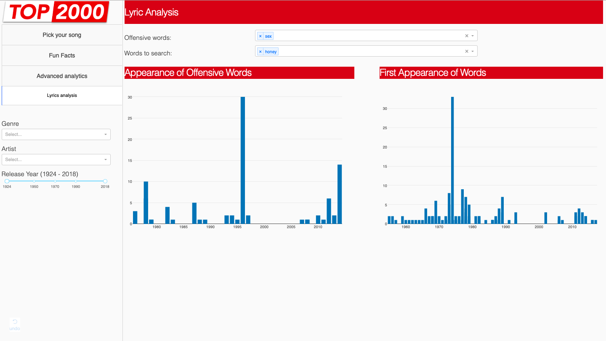

# Visualisation Assignment 4

Code in this directory is the result of a  dashboard our school group developed for the course "Data Visualisation" at the Jheronimus Academy of Data Science (JADS).

The purpose of this assignment was to develop a dashboard which allows for interactive browsing through data. 

Our team chose to work with Top2000 data, a yearly recurring 'song-competition' in the Netherlands where the entire country can vote for the 2000 best songs. The songs that make it into the list are played by Radio 2 from Christmas day noon until midnight of New Years eve. 

##### Team
* Sjoerd Broos
* Casper Verboon
* Vincent Munos
* Nima Mahzoun
* Joery de Vos

##### Result
Examples of what the app visually looks:

Landing page:

Fun Facts page:

Advanced analytics page:

Lyric analysis page:

##### Data sources
Data used in this assignment were gathered from the [Wikipedia Top2000 page](https://nl.wikipedia.org/wiki/Lijst_van_Radio_2-Top_2000%27s) and extended using Spotify WEB API's python library [Spotipy](https://spotipy.readthedocs.io/en/latest/)

##### How to run 
The assumption is that the program is run inside a virtual environment containing the data folder. 

The app is built on the packages and versions listed in requirements.txt

Make the dashboard run on your local machine by executing app.py 

